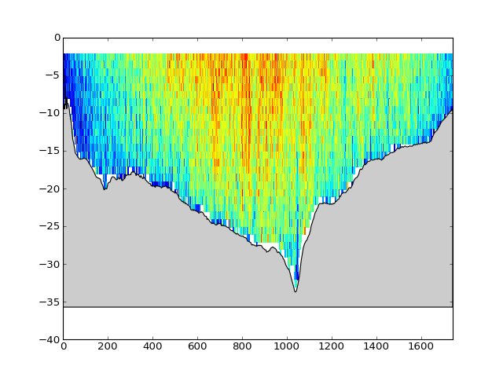

.. pyADCP documentation master file, created by
   sphinx-quickstart on Wed Mar 15 22:25:26 2017.
   You can adapt this file completely to your liking, but it should at least
   contain the root `toctree` directive.

Welcome to pyADCP's documentation!
==================================

pyADCP is a set of classes to deal with large amount of ADCP data stored in MySQL database. 

* Contact: chauvet[att]ipgp[ddot]fr
* Licence: GPL. This is a free software, feel free to modify and submit improvements. 

Different python files are involved in this project:

* *libADCP.py* the core library containing the following classes.
  
  1. River class
  
     The main class that contains functions to get data from MySQL and many useful functions to process data.
   	  
  2. Section class
  
     A class to deal with many fix measurements in a cross-section. The aim is to load many measurements (many River class) and work on all of them.
      
  3. Threader class
  
     To make request uses multi-threading (used by Section class)
      
  4. Adcp_Sql_Parser
  
     To create grouped SQL request to improve speed.
      
* *libImportADCP.py* the library to read generic ASCII files from WinRiver and parse them to a sql file

* *Importer.py* terminal interface to *libImportADCP* for importing WinRIVER ASCII files to MySQL.

A quick example 
---------------

With localhost database and user = ADCP and password = ADCP.

.. code-block:: python

  #Add path to library
  import sys
  sys.path.append('/path/to/libADCP')

  #import libraries
  from pylab import *
  from libADCP import *

  #Create a new object river for measurement id number 10 with data reference mode BT = Bottom Track
  river = River(idriverin=11,mode='BT',usa='ADCP',pasa='ADCP')  

  #Load Data
  #VM magnitude component
  #DEPTH depth of cells
  #TDMG travel meet good
  river.GetDatas('VM,DEPTH,TDMG')

  #Plot
  pcolormesh(river.datas['TDMG'],-river.datas['DEPTH'].ravel(),river.datas['VM']*10**-2)

  #Add bottom to the plot
  river.AddBottom(river.datas['TDMG'],gca())

  #set limites
  ylim(-40,0)
  xlim(min(river.datas['TDMG']),max(river.datas['TDMG']))

  show() 
  

   
   
.. toctree::
   :hidden:

   Install
   Tutorial
   
Indices and tables
==================

* :ref:`genindex`
* :ref:`modindex`
* :ref:`search`
